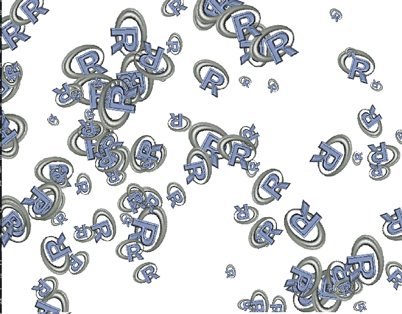
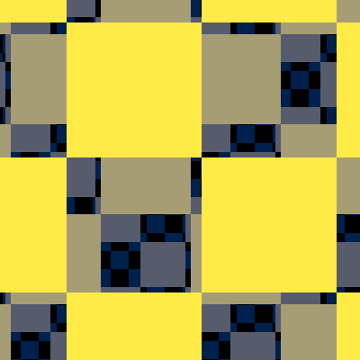
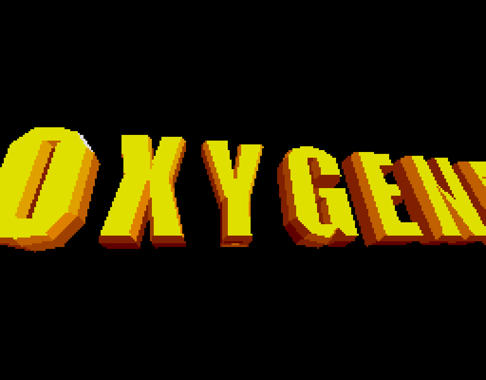
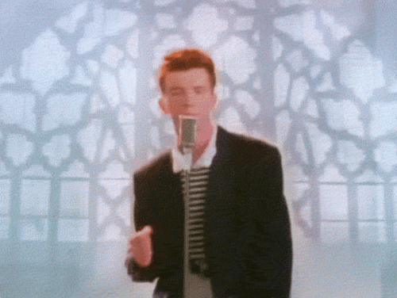
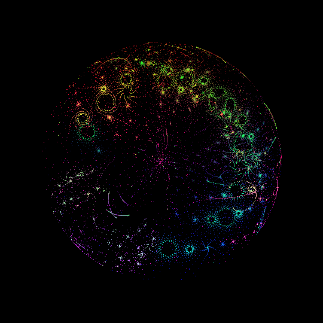
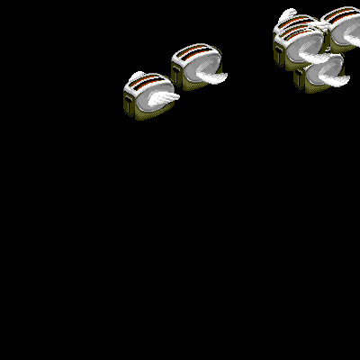
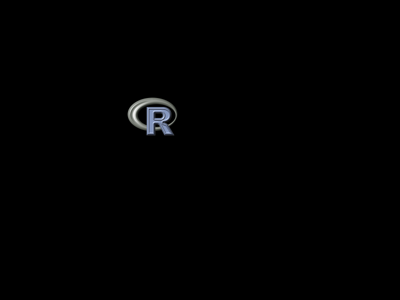
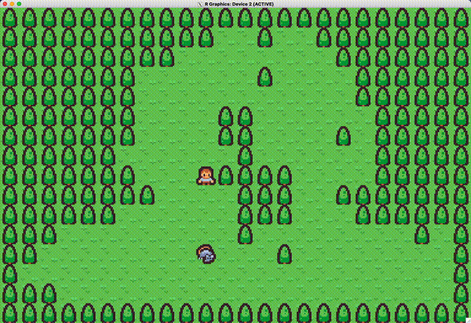

# `{nara}` demos

Some example demos written using [nara package](https://github.com/coolbutuseless/nara) 

All code in this repository is licensed MIT

### Rotozoom (multiple)

using `nr_blit_rotozoom()`

Realtime animation of 100 logos. (screenshot below)

### Parallex checkboard (via blitting)

### MPEG Playback

See [`{narampeg}` package](https://github.com/coolbutuseless/narampeg)

### Oxygene-R

This is a recreation of an Atari-ST demo often referred to as `ST-NICCC` from the
year 2000.

The demo plays 2 minutes of 3d animation.  (the following is just a still image from the
start of animation)

### Audio/Video Playback

Testing out audio/video playback using [`{nara}`](https://github.com/coolbutuseless/nara) 
and [`{governor}`](https://github.com/coolbutuseless/governor) 

**For linux users**, you will need to ensure you have `portaudio` installed (`apt-get install portaudio19-dev`)
and also possibly re-install the `{audio}` package.

No audio on github README pages, so please download and run `rick.R`

### Bubble Universe

Based on 'processing' code in a Tweet - https://x.com/yuruyurau/status/1226846058728177665
by twitter user @yuruyurau` 12:31 PM · Feb 10, 2020

### Flying Toasters

### Logo bounce

## Demos and explorations by others

## `{tilebased}`

[tilebased](https://github.com/matt-dray/tilebased) is a procedurally 
generated forest with controllable hero character by [Matt Dray](https://github.com/matt-dray)

